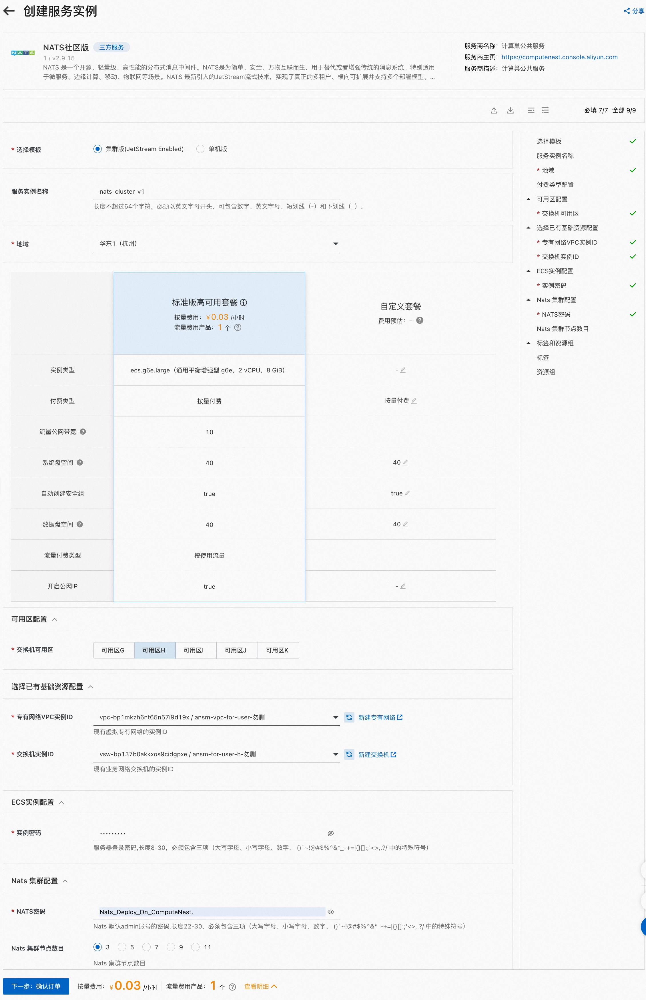
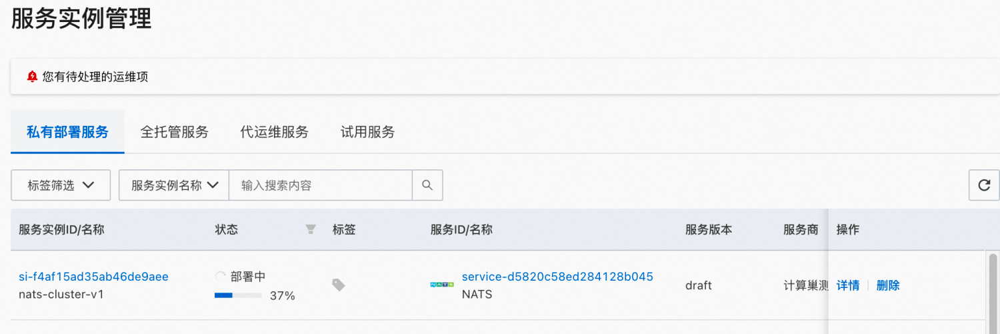
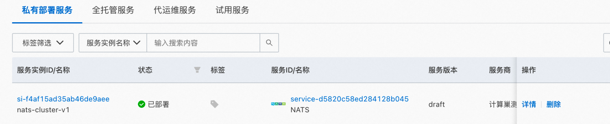
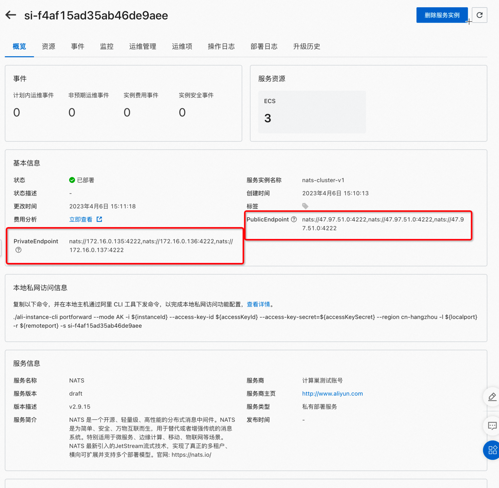

# NATS社区版服务实例部署文档


<!-- vim-markdown-toc GFM -->

* [概述](#概述)
* [计费说明](#计费说明)
* [部署架构](#部署架构)
* [所需权限](#所需权限)
* [部署流程](#部署流程)
	* [参数说明](#参数说明)
	* [部署步骤](#部署步骤)
* [集群配置探查](#集群配置探查)
* [NATS 集群实践](#nats-集群实践)
	* [创建context](#创建context)
	* [创建流](#创建流)
	* [发布消息](#发布消息)
	* [创建消费者](#创建消费者)
	* [消费消息](#消费消息)
	* [多实例消费](#多实例消费)
	* [查看流状态](#查看流状态)
	* [高可用验证](#高可用验证)
* [下一步](#下一步)
* [参考文档](#参考文档)

<!-- vim-markdown-toc -->
# 概述

NATS是一个开源、轻量级、高性能的分布式消息中间件。


随着NATS2.0的出现，NATS生态得到了极大的发展，NATS 2.0提供了分布式安全、去中心化管理、多租户、更大的网络、全球可扩展以及安全的数据共享。但NATS流在适应NATS 2.0方面存在很多限制，而且流系统还没有发展到能够应对下一代物联网和边缘计算的挑战。

NATS 2.0的下一代NATS流系统被称为NATS JetStream，具有分布式安全、多租户和水平扩展能力。


计算巢上提供了NATS社区版服务，您无需自行配置云主机，即可在计算巢上快速部署NATS服务、实现运维监控，从而方便地基于NATS搭建您自己云原生、分布式、微服务架构的业务应用。

本文向您介绍如何开通计算巢上的NATS社区版服务，以及部署流程和使用说明。

# 计费说明
NATS社区版在计算巢上的费用主要涉及：

- 所选vCPU与内存规格
- 磁盘容量
- 公网带宽(如果开启公网服务)

计费方式包括：

- 按量付费（小时）
- 包年包月

预估费用在创建实例时可实时看到。
# 部署架构
NATS社区版有单机部署和集群部署两种架构。

集群版目前可以支持选择3-11奇数个节点部署。

# 所需权限
NATS服务需要对ECS、VPC等资源进行访问和创建操作，若您使用RAM用户创建服务实例，需要在创建服务实例前，对使用的RAM用户的账号添加相应资源的权限。
添加RAM权限的详细操作，请参见[为RAM用户授权](https://help.aliyun.com/document_detail/121945.html)。所需权限如下表所示。

| 权限策略名称                    | 备注                                      |
|---------------------------------|-------------------------------------------|
| AliyunECSFullAccess             | 管理云服务器服务（ECS）的权限             |
| AliyunVPCFullAccess             | 管理专有网络（VPC）的权限                 |
| AliyunROSFullAccess             | 管理资源编排服务（ROS）的权限             |
| AliyunComputeNestUserFullAccess | 管理计算巢服务（ComputeNest）的用户侧权限 |
| AliyunCloudMonitorFullAccess    | 管理云监控（CloudMonitor）的权限          |


# 部署流程

本文档演示部署集群版的流程。

## 参数说明
您在创建服务实例的过程中，需要配置服务实例信息。下文介绍ZooKeeper社区版服务实例输入参数的详细信息。

| 参数组               | 参数项     | 示例                 | 说明                                                                                                              |
|----------------------|------------|----------------------|-------------------------------------------------------------------------------------------------------------------|
| 选择模板             | 模板选择   | 集群版               | 模板架构类型                                                                                                      |
| 服务实例名称         |            | test                 | 实例的名称                                                                                                        |
| 地域                 |            | 华东1（杭州）        | 选中服务实例的地域，建议就近选中，以获取更好的网络延时。                                                          |
| 可用区配置           | 部署区域   | 可用区I              | 地域下的不同可用区域                                                                                              |
| 付费类型配置         | 付费类型   | 按量付费 或 包年包月 |                                                                                                                   |
| 选择已有基础资源配置 | VPC ID     | vpc-xxx              | 选择专有网络的ID。                                                                                                |
| 选择已有基础资源配置 | 交换机ID   | vsw-xxx              | 选择交换机ID。若找不到交换机, 可尝试切换地域和可用区                                                              |
| ECS实例配置          | 实例类型   | ecs.g7.large         | 实例规格，可以根据实际需求选择                                                                                    |
| ECS实例配置          | 系统盘空间 | 40                   | 系统盘空间，可以根据实际需求选择                                                                                  |
| ECS实例配置          | 数据盘空间 | 40                   | 数据盘空间，可以根据实际需求选择                                                                                  |
| ECS实例配置          | 实例密码   | ********             | 设置实例密码。长度8~30个字符，必须包含三项（大写字母、小写字母、数字、()`~!@#$%^&*-+={}[]:;'<>,.?/ 中的特殊符号） |
| ECS实例配置          | 开启公网IP | true                 | 是否开启公网IP                                                                                                    |
| NATS配置             | 集群节点数 | 3                    | 集群版节点数                                                                                                      |
| NATS配置             | admin密码  | *****                | 默认admin用户的密码22-30字符                                                                                      |

## 部署步骤

单击[部署链接](https://computenest.console.aliyun.com/user/cn-hangzhou/serviceInstanceCreate?ServiceId=service-c63f342f7c7f48e8bbb5)，
进入服务实例部署界面，根据界面提示，可以选择默认的部署模板，快速部署，也可以使用自定义模板，对一些参数进行个性化配置。

详细的部署页面如下：



便捷的方式是选择默认的套餐，然后只需要选择可用区、选择VPC信息、配置实例密码、NATS密码点击即可进行集群创建。



等待大约1分钟，状态变为「已部署」时，集群即完成创建。

此时点击服务实例名称连接，进入连接页面：



可以看到公网和私网访问页面。

下面演示通过公网地址操作NATS.

# 集群配置探查

nats 配置文件
```bash
[root@iZbp139ju1kmizva7adgdbZ ~]# cat /etc/nats/nats.conf 
server_name=iZbp139ju1kmizva7adgdbZ-172-16-0-155
listen: 0.0.0.0:4222
http: 8222
accounts {
  $SYS {
    users = [
      { user: "admin",
        pass: "$2a$11$GUizXsS82Y.dll.uZXDic.qMDePF2IT6d3t5iWIs.rQ3lY1p6mDKC"
      }
    ]
  }
}

jetstream {
   store_dir=/data/nats-storage
}

cluster {
  name: C1
  listen: 0.0.0.0:4248
  routes = [
      
      nats-route://172.16.0.155:4248
      nats-route://172.16.0.157:4248
      nats-route://172.16.0.156:4248
  ]
}

```

从配置可以看到默认启用了JetStream特性，持久化目录存储在数据盘/data下
```bash
[root@iZbp19f7ptaaw66l28h5bnZ ~]# df -h
Filesystem      Size  Used Avail Use% Mounted on
devtmpfs        3.8G     0  3.8G   0% /dev
tmpfs           3.8G     0  3.8G   0% /dev/shm
tmpfs           3.8G  512K  3.8G   1% /run
tmpfs           3.8G     0  3.8G   0% /sys/fs/cgroup
/dev/vda1        40G  2.5G   35G   7% /
/dev/vdb1        40G   49M   38G   1% /data
tmpfs           768M     0  768M   0% /run/user/0
[root@iZbp19f7ptaaw66l28h5bnZ ~]# tree /data/nats-storage/
/data/nats-storage/
└── jetstream
    ├── $G
    │   └── streams
    │       └── my_stream
    │           ├── meta.inf
    │           ├── meta.sum
    │           ├── msgs
    │           │   ├── 1.blk
    │           │   ├── 1.fss
    │           │   └── 1.idx
    │           └── obs
    │               ├── foo_comsumer
    │               │   ├── meta.inf
    │               │   ├── meta.sum
    │               │   └── o.dat
    │               ├── foo_consumer
    │               │   ├── meta.inf
    │               │   ├── meta.sum
    │               │   └── o.dat
    │               └── foo_consumer2
    │                   ├── meta.inf
    │                   ├── meta.sum
    │                   └── o.dat
```
nats 使用systemd启动配置如下：
```bash

$ cat /etc/systemd/system/natsd.service 
[Unit]
Description=natsd.service

[Service]
Type=simple
ExecStart=/usr/bin/nats-server --config /etc/nats/nats.conf
Restart=always
RestartSec=10

[Install]
WantedBy=multi-user.target
```
# NATS 集群实践

## 创建context
```shell
$ nats context save computenest-nats --server nats://47.98.102.138:4222,nats://47.98.102.138:4222,nats://47.98.102.138:4222 --description 'ComputeNest NATS Cluster' --select
NATS Configuration Context "computenest-nats"

Description: ComputeNest NATS Cluster
Server URLs: nats://47.98.102.138:4222,nats://47.98.102.138:4222,nats://47.98.102.138:4222
Path: /root/.config/nats/context/computenest-nats.json
Connection: OK

$ nats context ls
╭──────────────────────────────────────────────╮
│                Known Contexts                │
├───────────────────┬──────────────────────────┤
│ Name              │ Description              │
├───────────────────┼──────────────────────────┤
│ computenest-nats* │ ComputeNest NATS Cluster │
│ local             │ Local Host               │
╰───────────────────┴──────────────────────────╯
```

接下来所有的步骤都默认会使用上面配置的计算巢 NATS 集群.
## 创建流
```bash
$ nats stream add my_stream
? Subjects foo
? Storage file
? Replication 3
? Retention Policy Limits
? Discard Policy Old
? Stream Messages Limit -1
? Per Subject Messages Limit -1
? Total Stream Size -1
? Message TTL -1
? Max Message Size -1
? Duplicate tracking time window 2m0s
? Allow message Roll-ups No
? Allow message deletion Yes
? Allow purging subjects or the entire stream Yes

Stream my_stream was created

Information for Stream my_stream created 2023-04-09 08:28:33

             Subjects: foo
             Replicas: 3
              Storage: File

Options:

            Retention: Limits
     Acknowledgements: true
       Discard Policy: Old
     Duplicate Window: 2m0s
    Allows Msg Delete: true
         Allows Purge: true
       Allows Rollups: false

Limits:

     Maximum Messages: unlimited
  Maximum Per Subject: unlimited
        Maximum Bytes: unlimited
          Maximum Age: unlimited
 Maximum Message Size: unlimited
    Maximum Consumers: unlimited


Cluster Information:

                 Name: C1
               Leader: iZbp139ju1kmizva7adgdcZ-172-16-0-157
              Replica: iZbp139ju1kmizva7adgdbZ-172-16-0-155, current, seen 0.00s ago
              Replica: iZbp139ju1kmizva7adgddZ-172-16-0-156, current, seen 0.00s ago

State:

             Messages: 0
                Bytes: 0 B
             FirstSeq: 0
              LastSeq: 0
     Active Consumers: 0

```

**注意事项：**

- Replication 配置为3，指明创建的流具备三个副本的高可用版本，NATS 会基于RAFT协议进行数据备份实现高可用

## 发布消息
本部分使用`nats pub`命令进行发布消息
```bash
$ nats pub foo --count=1000 --sleep 1s "publication #{{Count}} @ {{TimeStamp}}"
 27 / 1000 [====>--------------------------------------------] 26 

```

## 创建消费者
要消费消息，首先要创建消费者：
```bash
$ nats consumer add
? Consumer name foo_consumer
? Delivery target (empty for Pull Consumers) 
? Start policy (all, new, last, subject, 1h, msg sequence) all
? Acknowledgement policy explicit
? Replay policy instant
? Filter Stream by subject (blank for all) 
? Maximum Allowed Deliveries -1
? Maximum Acknowledgements Pending 0
? Deliver headers only without bodies No
? Add a Retry Backoff Policy No
? Select a Stream my_stream
Information for Consumer my_stream > foo_consumer created 2023-04-09T08:31:23+08:00

Configuration:

        Durable Name: foo_consumer
           Pull Mode: true
      Deliver Policy: All
          Ack Policy: Explicit
            Ack Wait: 30s
       Replay Policy: Instant
     Max Ack Pending: 1,000
   Max Waiting Pulls: 512

Cluster Information:

                Name: C1
              Leader: iZbp139ju1kmizva7adgddZ-172-16-0-156
             Replica: iZbp139ju1kmizva7adgdbZ-172-16-0-155, current, not seen
             Replica: iZbp139ju1kmizva7adgdcZ-172-16-0-157, current, seen 0.00s ago

State:

   Last Delivered Message: Consumer sequence: 0 Stream sequence: 0
     Acknowledgment floor: Consumer sequence: 0 Stream sequence: 0
         Outstanding Acks: 0 out of maximum 1,000
     Redelivered Messages: 0
     Unprocessed Messages: 45
            Waiting Pulls: 0 of maximum 512


```
## 消费消息
创建完消费者后就可以进行消费数据：
```bash
$ nats consumer next my_stream foo_consumer --count 1000
[09:05:18] subj: foo / tries: 1 / cons seq: 1 / str seq: 1 / pending: 27

publication #1 @ 2023-04-06T15:17:18+08:00

Acknowledged message

[09:05:18] subj: foo / tries: 1 / cons seq: 2 / str seq: 2 / pending: 26

publication #2 @ 2023-04-06T15:17:19+08:00

Acknowledged message

[09:05:18] subj: foo / tries: 1 / cons seq: 3 / str seq: 3 / pending: 25
...
```

## 多实例消费
多实例消费演示多个实例同时消费一个topic时，NATS 会进行一定的负载均衡保证每个启动的实例均分生产的消息，这在实际业务中可以做负载均衡，消费者水平扩展。

消费实例1:

```bash
$ nats consumer next my_stream foo_consumer --count 1000
...
[08:33:45] subj: foo / tries: 1 / cons seq: 186 / str seq: 186 / pending: 0

publication #186 @ 2023-04-09T08:33:45+08:00

Acknowledged message

[08:33:47] subj: foo / tries: 1 / cons seq: 188 / str seq: 188 / pending: 0

publication #188 @ 2023-04-09T08:33:47+08:00

Acknowledged message

[08:33:49] subj: foo / tries: 1 / cons seq: 190 / str seq: 190 / pending: 0

publication #190 @ 2023-04-09T08:33:49+08:00

Acknowledged message

[08:33:51] subj: foo / tries: 1 / cons seq: 192 / str seq: 192 / pending: 0

publication #192 @ 2023-04-09T08:33:51+08:00

Acknowledged message
...
```

消费实例2:

```bash
$ nats consumer next my_stream foo_consumer --count 1000
[08:33:46] subj: foo / tries: 1 / cons seq: 187 / str seq: 187 / pending: 0

publication #187 @ 2023-04-09T08:33:46+08:00

Acknowledged message

[08:33:48] subj: foo / tries: 1 / cons seq: 189 / str seq: 189 / pending: 0

publication #189 @ 2023-04-09T08:33:48+08:00

Acknowledged message

[08:33:50] subj: foo / tries: 1 / cons seq: 191 / str seq: 191 / pending: 0

publication #191 @ 2023-04-09T08:33:50+08:00

Acknowledged message

[08:33:52] subj: foo / tries: 1 / cons seq: 193 / str seq: 193 / pending: 0

publication #193 @ 2023-04-09T08:33:52+08:00

Acknowledged message

```
## 查看流状态

```bash
$ nats stream info my_stream
nats stream info my_stream
Information for Stream my_stream created 2023-04-09 08:28:33

             Subjects: foo
             Replicas: 3
              Storage: File

Options:

            Retention: Limits
     Acknowledgements: true
       Discard Policy: Old
     Duplicate Window: 2m0s
    Allows Msg Delete: true
         Allows Purge: true
       Allows Rollups: false

Limits:

     Maximum Messages: unlimited
  Maximum Per Subject: unlimited
        Maximum Bytes: unlimited
          Maximum Age: unlimited
 Maximum Message Size: unlimited
    Maximum Consumers: unlimited


Cluster Information:

                 Name: C1
               Leader: iZbp139ju1kmizva7adgdcZ-172-16-0-157
              Replica: iZbp139ju1kmizva7adgdbZ-172-16-0-155, current, seen 0.85s ago
              Replica: iZbp139ju1kmizva7adgddZ-172-16-0-156, current, seen 0.85s ago

State:

             Messages: 350
                Bytes: 26 KiB
             FirstSeq: 1 @ 2023-04-09T00:30:38 UTC
              LastSeq: 350 @ 2023-04-09T00:36:30 UTC
     Active Consumers: 1
   Number of Subjects: 1

```

说明：

- 可以看到流的副本数为3
- 集群信息部分可以看到node2-c1 这个节点是Leader，node1、node3是Follower

下一步将node2节点宕机观看流的情况。
## 高可用验证

通过查看流的状态发现创建的流的leader节点是"iZbp139ju1kmizva7adgdcZ-172-16-0-157"，
现在将此节点关机:

之后再查看流的状态
```bash
$ nats stream info my_stream
Information for Stream my_stream created 2023-04-09 08:28:33

             Subjects: foo
             Replicas: 3
              Storage: File

Options:

            Retention: Limits
     Acknowledgements: true
       Discard Policy: Old
     Duplicate Window: 2m0s
    Allows Msg Delete: true
         Allows Purge: true
       Allows Rollups: false

Limits:

     Maximum Messages: unlimited
  Maximum Per Subject: unlimited
        Maximum Bytes: unlimited
          Maximum Age: unlimited
 Maximum Message Size: unlimited
    Maximum Consumers: unlimited


Cluster Information:

                 Name: C1
               Leader: iZbp139ju1kmizva7adgddZ-172-16-0-156
              Replica: iZbp139ju1kmizva7adgdbZ-172-16-0-155, current, seen 0.38s ago
              Replica: iZbp139ju1kmizva7adgdcZ-172-16-0-157, outdated, OFFLINE, seen 20.64s ago, 548 operations behind

State:

             Messages: 545
                Bytes: 41 KiB
             FirstSeq: 1 @ 2023-04-09T00:30:38 UTC
              LastSeq: 545 @ 2023-04-09T00:39:46 UTC
     Active Consumers: 1
   Number of Subjects: 1

```

可以看到集群状态部分 156号节点变成新的Leader，157状态为OFFLINE。

此时创建新的消费者重新消费数据：
```bash
nats consumer add
? Consumer name foo_consumer2
? Delivery target (empty for Pull Consumers) 
? Start policy (all, new, last, subject, 1h, msg sequence) all
? Acknowledgement policy explicit
? Replay policy instant
? Filter Stream by subject (blank for all) 
? Maximum Allowed Deliveries -1
? Maximum Acknowledgements Pending 0
? Deliver headers only without bodies No
? Add a Retry Backoff Policy No
? Select a Stream my_stream

Information for Consumer my_stream > foo_consumer2 created 2023-04-09T08:42:07+08:00

Configuration:

        Durable Name: foo_consumer2
           Pull Mode: true
      Deliver Policy: All
          Ack Policy: Explicit
            Ack Wait: 30s
       Replay Policy: Instant
     Max Ack Pending: 1,000
   Max Waiting Pulls: 512

Cluster Information:

                Name: C1
              Leader: iZbp139ju1kmizva7adgdbZ-172-16-0-155
             Replica: iZbp139ju1kmizva7adgdcZ-172-16-0-157, outdated, not seen
             Replica: iZbp139ju1kmizva7adgddZ-172-16-0-156, current, seen 0.00s ago

State:

   Last Delivered Message: Consumer sequence: 0 Stream sequence: 0
     Acknowledgment floor: Consumer sequence: 0 Stream sequence: 0
         Outstanding Acks: 0 out of maximum 1,000
     Redelivered Messages: 0
     Unprocessed Messages: 685
            Waiting Pulls: 0 of maximum 512
 
$ nats consumer next my_stream foo_consumer2 --count 3
[08:42:27] subj: foo / tries: 1 / cons seq: 1 / str seq: 1 / pending: 703

publication #1 @ 2023-04-09T08:30:38+08:00

Acknowledged message

[08:42:27] subj: foo / tries: 1 / cons seq: 2 / str seq: 2 / pending: 702

publication #2 @ 2023-04-09T08:30:39+08:00

Acknowledged message

[08:42:27] subj: foo / tries: 1 / cons seq: 3 / str seq: 3 / pending: 701

publication #3 @ 2023-04-09T08:30:40+08:00

Acknowledged message
```
此时故障节点恢复之后：重新查看流的状态：

```bash
$  nats stream info my_stream
Information for Stream my_stream created 2023-04-09 08:28:33

             Subjects: foo
             Replicas: 3
              Storage: File

Options:

            Retention: Limits
     Acknowledgements: true
       Discard Policy: Old
     Duplicate Window: 2m0s
    Allows Msg Delete: true
         Allows Purge: true
       Allows Rollups: false

Limits:

     Maximum Messages: unlimited
  Maximum Per Subject: unlimited
        Maximum Bytes: unlimited
          Maximum Age: unlimited
 Maximum Message Size: unlimited
    Maximum Consumers: unlimited


Cluster Information:

                 Name: C1
               Leader: iZbp139ju1kmizva7adgddZ-172-16-0-156
              Replica: iZbp139ju1kmizva7adgdbZ-172-16-0-155, current, seen 0.22s ago
              Replica: iZbp139ju1kmizva7adgdcZ-172-16-0-157, current, seen 0.22s ago

State:

             Messages: 780
                Bytes: 58 KiB
             FirstSeq: 1 @ 2023-04-09T00:30:38 UTC
              LastSeq: 780 @ 2023-04-09T00:43:43 UTC
     Active Consumers: 2
   Number of Subjects: 1

```

可以看到流的集群信息三个节点全部变为可用状态，刚异常的node2节点恢复了,加入之前两个健康节点的集群后自动变成了follower。

# 下一步
NATS 目前逐步演变为一个生态，可以实践、演示的功能还非常多，包括单不限于以下方面：

- **安全认证**：支持Token、user/pass、TLS、NKEY、JWT等安全配置
- **连接协议**：除了基于默认的nats 连接协议外，还支持WebSocket、MQTT连接，并且可以通过Kafka Bridge JMS 将其他消息系统的流量转到NATS
- JetStream [更多的功能](https://docs.nats.io/nats-concepts/jetstream)：JetStream 是NATS最新一代的高可用流式系统，支持非常多的高级特性：
   - 流重放策略
   - 流式存储
   - 保留策略
   - 消息配额
   - 持久化
   - 流Mirror
   - 双端流控
   - Exactly-Once语义支持
- **多租户管理**：基于[nsc](https://docs.nats.io/using-nats/nats-tools/nsc)工具进行多租户账号配置管理
- **边缘场景**：为了支持边缘计算、IOT场景，NATS支持在边缘部署本地的NATS集群，跟中心集群交互。使得边缘设备可以通过连接边缘本地集群快速进行业务数据的生产，不会强依赖跟远端中心集群的网络稳定性，边缘场景[参考](https://docs.nats.io/running-a-nats-service/configuration/leafnodes)。


# 参考文档
[1]: nats cluster creation: [https://docs.nats.io/running-a-nats-service/nats_docker#creating-a-nats-cluster](https://docs.nats.io/running-a-nats-service/nats_docker#creating-a-nats-cluster)

[2]: jetString cluster: [https://docs.nats.io/running-a-nats-service/configuration/clustering/jetstream_clustering](https://docs.nats.io/running-a-nats-service/configuration/clustering/jetstream_clustering)

[3]: js walkthrough： [https://docs.nats.io/nats-concepts/jetstream/js_walkthrough](https://docs.nats.io/nats-concepts/jetstream/js_walkthrough)

[4]: [基于NATS JetStream构建分布式事件流系统](https://www.jianshu.com/p/27a49b9d4306)

